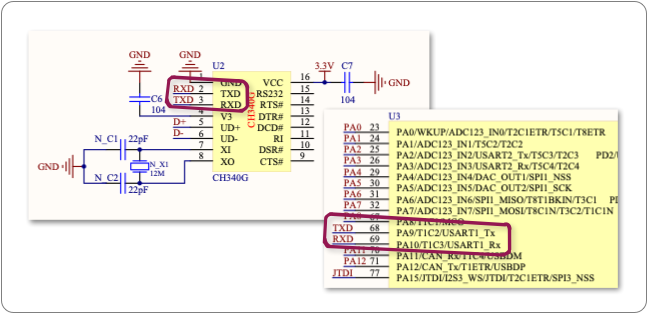
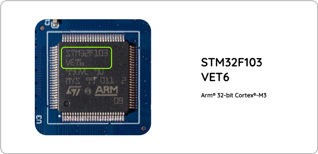
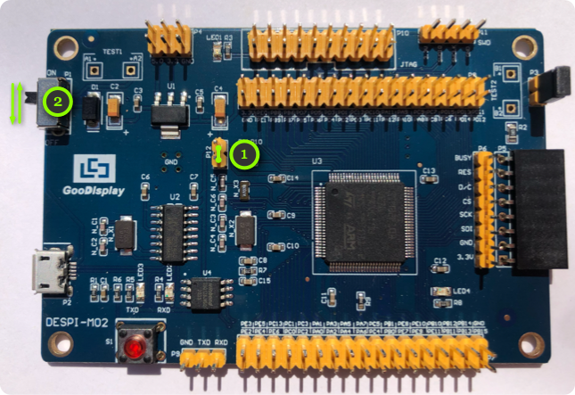

# Flashing a Rust Program to the DESPI-M02

Here are instructions to flashing a Rust program to the DESPI-M02. I wrote these
because I had some trouble finding details on how to work with Rust on my
DESPI-M02 boards. In particular, most documentation seems to assume you have a
debug probe handy, which I do not. Board-specific examples tend to just give you
the code, but do not explain how to find pin numbers and other board details.

In this tutorial I try to not just show the code, but also explain how to read
data sheets and board schematics. Those provide authoritative information that
you need during programming. For example, we will see how the schematic shows us
whether a LED is active-low or active-high, which pins each board peripheral is
connected to, or what pull-up and pull-down values you need on your pins.

I use Mac OS X. The examples and screenshots work on my computer, but you may
have to adapt them slightly to fit you operating system.

By the way, this is a sister project to
[despi-m02-arduino](https://github.com/kjkoster/despi-m02-arduino), in case you
want to do the same with an Arduino sketch.

## Pin Definitions
As practice code, we will use the on-board push button and LED to do a version of the
venerable blinky: the push button controls the speed at which the LED blinks. This
means we'll have to look at the schematics to find how the peripherals are
connected and implement some kind of debounce on top of that.

To write our blinky, we need to know what pins the on-board LED and push-button
are connected to. Referring to the
[DESPI-M02 schematic](https://www.good-display.com/companyfile/DESPI-M02-SCH-31.html),
we can see that `LED4` is connected to pin `PE12` and that the push-button
controls pin `PE11`.

<p align="center" width="100%">
    
</p>

If you take a moment to study how current would flow through the LED, you can
see that `LED4` is connected as active-low. In our programs, we should start
with the LED on, to shorten the apparent boot time. If you start with the LED
pin set high, the LED is off for two seconds after booting the device. You may
be left wondering if the device had been flashed properly. Two seconds can be a
long time to wait if you are unsure that your program actually works.

Similarly, you can see from the schematic that the push-button is active-low and
requires a pull-up resistor to work. Electrically, the input pin is left
floating when the button is at rest. When pressed, it pulls the input pin to
ground. Enabling an internal pull-up resistor on pin `PE11` will complete this
circuit. The pin is then pulled high when the button is at rest and pulled low
when the button is pressed down.

While we have the schematic out, let's also look up the `TX` and `RX` pins for
the serial port. We can use those to set up a simple serial logger.

<p align="center" width="100%">
    
</p>

The schematic shows that the serial port is connected to pins `PA9` and `PA10`.
`PA9` is the transmit (TX) pin and `PA10` is the receive pin (RX). Flow control
is not connected, but flow control is not really critical for debug logging
anyway.

In code, we attach to the UART using DMA for trace logging. The
[Rust Embassy framework](https://embassy.dev/) makes using DMA really easy. The
UART peripheral configuration is statically checked with the HAL. Rust may be
finicky to compile, but when it finally compiles you are probably mostly done.
The schematic shows that the USB serial port is wired to `USART1`, so we use
that in code.

We now gathered enough details on the peripherals to write our blinky. See
[src/main.rs](src/main.rs) for the full implementation.

## Target Platform Configuration
Code done; now we have to set up the Rust toolchain to compile and ultimately
flash the code to our board. The first task is to determine the exact toolchain
that we need to cross-compile for the target platform. That is expressed as a
so-called "target triple". Determining the target triple starts by looking at
the CPU on your board (usually the biggest chip). You can look this up in the
documentation that comes with your board, but I found that the documentation
does not always match the precise board shipped. Checking the actual device
helps eliminate any ambiguity.

<p align="center" width="100%">
    
</p>

When we look at the
[data sheet for the STM32F103VET6](https://www.st.com/resource/en/datasheet/stm32f103ve.pdf),
it is identified as an Arm® 32-bit Cortex®-M3. After some searching through the
`rustc` book, we find that the
[target triple for the ARM Cortex-M3 is `thumbv7m-none-eabi`](https://doc.rust-lang.org/nightly/rustc/platform-support/thumbv7m-none-eabi.html).

This value is then used in (and has to be consistent across) three places:

- `rust-toolchain.toml` where it defines what target to install using `rustup`.
- `.cargo/config.toml` where it defines what target to compile for.
- Your editor settings for `rust-analyzer`. You can find those in
  `.zed/settings.json` since my editor is Zed. Your IDE will have documentation
  explaining how to do these settings.

## Installing the Rust Toolchain
Installation of the toolchain and the platform targets is handled using the
`rust-toolchain.toml` file. As part of the build process, `cargo` reads the
toolchain file and installs any missing components or targets. Think of this as
a dependency file like `Cargo.toml`, but for your toolchain instead of your
code. You can also use `rust-toolchain.toml` to lock your toolchain to a
specific version of Rust, if you need reproducible builds for production
systems. Pretty neat.

The only Rust component that needs manual installation is `cargo-binutils`,
which you can install as shown below. This will resolve the `rust-objcopy: not
found` error you may be seeing when you flash the binary to the board.

```sh
cargo install cargo-binutils
```

And finally, you will need the actual flasher:
[`stm32flash`](https://github.com/stm32duino/stm32flash), which you can install
using `brew`:

```sh
brew install stm32flash
```

Officially, `stm32flash` is deprecated, but I found it a lot easier to install
and use than the STM32 Cube Programmer that replaces it. Plus, `stm32flash`  is
open source.

## Serial Port Configuration
To flash your program to the board, first set the correct serial port in
`.cargo/config.toml`. This is done via an environment variable. That value is
set in `.cargo/config.toml` and read in `flash.sh`.

## Flashing your Program
Now it is time to see if everything was set up correctly and works. Plug the
DESPI-M02 into your computer using a micro-USB cable. STM32 chips enter flash
mode when pin `boot0` is pulled high as the chip powers up. On the board
schematic, we can see that this pin made available on header `P12`.

<p align="center" width="100%">
    
</p>

To enter flash mode, bridge header `P12` with a jumper or anything metallic
really, and toggle the board power with switch `P1`.

<p align="center" width="100%">
    
</p>

Don't forget to remove the `P12` jumper after flashing.

Then run your code on the device using:

```sh
cargo run
```

If everything worked, you will see the on-board LED flashing slowly and you can
control its speed by repeatedly pressing the red button on the board. Every time
you press a button, a message is logged on the serial port. If you look
carefully, you can see `LED3` flashing briefly as the bytes are transmitted.

## Optimising Binary Size
By default, Rust compiles and links with fairly conservative optimiser settings.
Compilation is quick, but the resulting binaries can be fairly large. On
embedded systems, large binaries can be a problem. They may simply not fit. I
also found that it takes quite long to flash a binary to my development board,
hindering quick iterations.

There are good resources on how to solve this, so I will not repeat them here,
but you may want to have a look at
[Minimizing Rust Binary Size](https://github.com/johnthagen/min-sized-rustdt). I
took some of their advice and set up a release profile in
[`Cargo.toml`](Cargo.toml) with optimiser flags. On my machine, this reduces the
resultant binary from 67k to less than 8k. The link-time optimiser in particular
seems to make a big difference.

```sh
cargo run --release
```

You can review the sizes of the binaries using a handy little tool called
[Cargo Bloat](https://docs.rs/crate/cargo-bloat/).

## Power Consumption
Having two very similar projects on the same hardware allows us to compare power
usage per language. Embassy makes the claim that code written for Embassy is
automatically more power efficient, because the Embassy scheduler puts the MCU
to sleep when there is no work to be done.

Measuring the Arduino busy-loop based blinky shows the board drawing about
30&nbsp;mA. The USB power measurement dongle that I used does not work for
choppy workloads, so the Rust based blinky actually shows up as drawing
0&nbsp;mA. Zero current for a blinky is not possible, of course, but it does
demonstrate that the Embassy scheduler puts the MCU to sleep when there is no
work to be done. Nice. Easy power savings.

Of course, we can also implement low power mode and sleep states in Arduino, but
the point here is that Embassy enourages you to to use power efficient code
where Arduino nudges you in the direction of a busy loop and thus to use more
power.

Embassy probably uses light sleep, so you can still gain more power efficiency
by putting the system into deep sleep. Embassy cannot do that, because deep
sleep also shuts down power to various peripherals. Without knowing the system
use-cases, there is no way for the framework to know what is and is not being
used.

Hope this helps.

--
